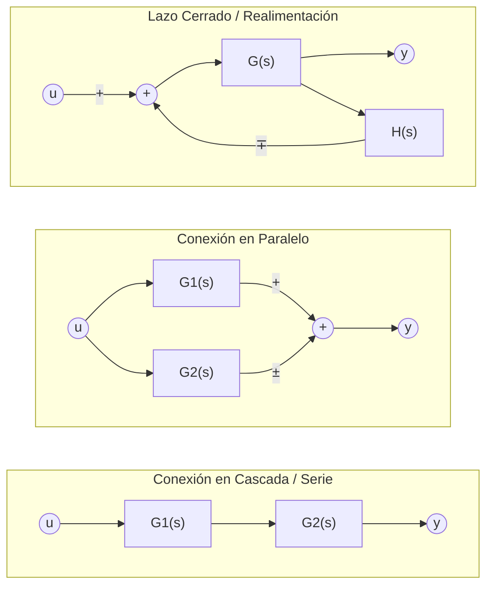

# Guía Maestra: Variables de Estado y Sistemas Lineales

---

## 1. Fundamentos: ¿Qué representan las matrices?

Cualquier sistema dinámico lineal e invariante en el tiempo (LTI) se modela mediante dos ecuaciones vectoriales básicas:

$$\begin{cases} 
\dot{\mathbf{x}}(t) = A \mathbf{x}(t) + B u(t) & \text{(Ecuación de Estado)} \\ 
y(t) = C \mathbf{x}(t) + D u(t) & \text{(Ecuación de Salida)} 
\end{cases}$$

### Anatomía de las variables y dimensiones (para orden $n$, 1 entrada, 1 salida)
* **$\mathbf{x}(t) \in \mathbb{R}^{n \times 1}$ (Vector de Estado):** Conjunto mínimo de variables internas ($x_1, x_2, \dots, x_n$) que almacenan la energía o memoria del sistema (tensiones en capacitores, corrientes en inductores, posiciones, velocidades, tanques de líquido). Conocerlas en un instante $t_0$ permite predecir todo el comportamiento futuro.
* **$\dot{\mathbf{x}}(t) \in \mathbb{R}^{n \times 1}$:** Vector de derivadas temporales de los estados ($\frac{dx_1}{dt}, \frac{dx_2}{dt}, \dots$).
* **$u(t) \in \mathbb{R}$ (Señal de Entrada):** La fuerza, tensión o estímulo externo que se inyecta activamente desde afuera.
* **$y(t) \in \mathbb{R}$ (Señal de Salida):** La variable física que realmente medimos con un sensor o nos interesa monitorear.
* **Matriz $A \in \mathbb{R}^{n \times n}$ (Matriz del Sistema / Dinámica):** Modela cómo interactúan y se acoplan los estados internos entre sí en ausencia de fuerzas externas. Sus autovalores definen la estabilidad natural y la velocidad de respuesta del proceso.
* **Matriz $B \in \mathbb{R}^{n \times 1}$ (Matriz de Entrada):** Modela por qué ecuaciones entra la señal externa $u(t)$ y con qué peso o ganancia afecta a cada variable de estado.
* **Matriz $C \in \mathbb{R}^{1 \times n}$ (Matriz de Salida):** Vector fila que combina linealmente los estados internos para conformar lo que ve el sensor a la salida.
* **Matriz $D \in \mathbb{R}^{1 \times 1}$ (Matriz de Transmisión Directa):** Ganancia directa desde la entrada hacia la salida sin pasar por la dinámica interna. En sistemas físicos reales (estrictamente propios) casi siempre es **$D = 0$**, porque ninguna masa o circuito reacciona instantáneamente sin demora física.

---

## 2. Las Cuatro Formas Canónicas (Construcción desde $G(s)$)

Dada una función de transferencia de orden 2 estrictamente propia:
$$G(s) = \frac{Y(s)}{U(s)} = \frac{b_1 s + b_0}{s^2 + a_1 s + a_0}$$

> **Regla de normalización:** El coeficiente de la potencia más alta del denominador ($s^n$) SIEMPRE debe ser $1$. Si tuviera un número multiplicando (ej. $2s^2$), se debe dividir todo el numerador y denominador por ese número antes de empezar.

---

### Forma Canónica Controlable (FCC)
* **Concepto:** Toda la señal de control $u(t)$ entra exclusivamente por la última variable de estado ($\dot{x}_n$). Las demás variables son integradores en cascada ($x_1' = x_2$, $x_2' = x_3$).
* **Estructura de $A$:** Unos en la superdiagonal (desplazamiento a la derecha de la diagonal principal). La última fila contiene los coeficientes del denominador ordenados de menor a mayor potencia y **con el signo invertido**.
* **Estructura de $B$:** Columna con ceros en todas las filas salvo un $1$ en la última.
* **Estructura de $C$:** Fila con los coeficientes del numerador en orden ascendente ($b_0, b_1, \dots$).

$$A = \begin{bmatrix} 0 & 1 \\ -a_0 & -a_1 \end{bmatrix}, \quad B = \begin{bmatrix} 0 \\ 1 \end{bmatrix}, \quad C = \begin{bmatrix} b_0 & b_1 \end{bmatrix}$$

---

### Forma Canónica Observable (FCO)
* **Concepto:** Es la versión geométrica "espejada" (dual traspuesta) de la FCC. La salida $y(t)$ solo mide directamente el último estado ($y = x_n$).
* **Propiedad de construcción:** 
  $$A_{FCO} = A_{FCC}^T, \quad B_{FCO} = C_{FCC}^T, \quad C_{FCO} = B_{FCC}^T$$
* **Estructura:**
  * En $A$, la última columna lleva los coeficientes del denominador cambiados de signo.
  * En $B$, entran los coeficientes del numerador.
  * En $C$, es un vector fila con ceros y un $1$ al final.

$$A = \begin{bmatrix} 0 & -a_0 \\ 1 & -a_1 \end{bmatrix}, \quad B = \begin{bmatrix} b_0 \\ b_1 \end{bmatrix}, \quad C = \begin{bmatrix} 0 & 1 \end{bmatrix}$$

---

### Forma Canónica Diagonal (FCD)
* **Concepto:** Desacopla completamente las variables. Cada ecuación diferencial depende únicamente de su propio estado ($\dot{x}_i = p_i x_i + u$). El sistema equivale a tener subsistemas de primer orden funcionando en paralelo.
* **Condición de uso:** Todos los polos del denominador deben ser **reales y distintos**.

#### Procedimiento paso a paso:
1. Hallar los polos $p_1, p_2$ resolviendo el denominador $s^2 + a_1 s + a_0 = 0$.
2. Descomponer $G(s)$ en fracciones simples:
   $$G(s) = \frac{d_1}{s - p_1} + \frac{d_2}{s - p_2}$$
3. Calcular los residuos $d_i$ con el método de Heaviside (tapar con el dedo el factor correspondiente y evaluar en la raíz).
4. Armar las matrices:
   * **$A$:** Diagonal principal con los polos $p_i$ tal cual son (con su signo real). El resto ceros.
   * **$B$:** Vector columna de unos: $[1 \quad 1 \dots 1]^T$.
   * **$C$:** Vector fila con los residuos $d_i$ en el mismo orden que pusiste los polos en $A$.

$$A = \begin{bmatrix} p_1 & 0 \\ 0 & p_2 \end{bmatrix}, \quad B = \begin{bmatrix} 1 \\ 1 \end{bmatrix}, \quad C = \begin{bmatrix} d_1 & d_2 \end{bmatrix}$$

---

### Forma Canónica de Jordan (FCJ)
* **Concepto:** Aparece cuando hay **polos repetidos (multiplicidad algebraica mayor a 1)**. Como las fracciones simples no se pueden separar en polos aislados, el sistema no se puede diagonalizar por completo; se debe conectar a los polos gemelos mediante una pequeña "cadena" llamada **bloque de Jordan**.

#### Procedimiento paso a paso:
1. Identificar la multiplicidad. Supongamos un polo doble en $p_1$ y un polo simple en $p_2$:
   $$Denominador = (s - p_1)^2 (s - p_2)$$
2. Descomponer abriendo potencias sucesivas:
   $$G(s) = \frac{d_1}{s - p_1} + \frac{d_2}{(s - p_1)^2} + \frac{d_3}{s - p_2}$$
3. Armar las matrices:
   * **$A$:** Colocar los polos en la diagonal principal. En el grupo repetido, colocar un **$1$** inmediatamente por encima de la diagonal (superdiagonal) para encadenar las variables.
   * **$B$:** Para el bloque repetido, **solo la última fila lleva un $1$**; las filas anteriores del bloque llevan **$0$**. Para los polos simples que no se repiten, llevan su $1$ habitual.
   * **$C$:** Vector fila con los numeradores $d_i$ asociados a cada estado.

$$A = \begin{bmatrix} p_1 & \mathbf{1} & 0 \\ 0 & p_1 & 0 \\ 0 & 0 & p_2 \end{bmatrix}, \quad B = \begin{bmatrix} \mathbf{0} \\ \mathbf{1} \\ 1 \end{bmatrix}, \quad C = \begin{bmatrix} d_1 & d_2 & d_3 \end{bmatrix}$$

---

## 3. De Matrices $(A, B, C, D)$ a Función de Transferencia $G(s)$

Dada una cuádrupla cualquiera de matrices numéricas, para extraer la función $G(s)$ analíticamente se aplica:

$$G(s) = C(sI - A)^{-1}B + D$$

### Algoritmo práctico de cálculo manual:
1. **Calcular $(sI - A)$:** A la matriz identidad multiplicada por la variable compleja $s$, restarle la matriz numérica $A$.
   $$sI - A = \begin{bmatrix} s & 0 \\ 0 & s \end{bmatrix} - \begin{bmatrix} a_{11} & a_{12} \\ a_{21} & a_{22} \end{bmatrix} = \begin{bmatrix} s - a_{11} & -a_{12} \\ -a_{21} & s - a_{22} \end{bmatrix}$$

2. **Calcular el determinante $\det(sI - A)$:**
   $$\det(sI - A) = (s - a_{11})(s - a_{22}) - (-a_{12})(-a_{21})$$
   > Este polinomio del denominador es exactamente el **polinomio característico** del sistema; sus raíces son los polos.

3. **Invertir la matriz $(sI - A)$:** Para $2 \times 2$, aplicar la regla clásica: permutar los términos de la diagonal principal, cambiar de signo los otros dos, y dividir por el determinante:
   $$(sI - A)^{-1} = \frac{1}{\det(sI - A)} \begin{bmatrix} s - a_{22} & a_{12} \\ a_{21} & s - a_{11} \end{bmatrix}$$

4. **Multiplicar por $B$ y $C$:**
   * Primero multiplicar la matriz por la columna $B$: $V(s) = (sI - A)^{-1} B$ (da un vector columna).
   * Luego premultiplicar por la fila $C$: $G(s) = C \cdot V(s)$ (da un escalar en función de $s$).
   * Dejar siempre el $\det(sI - A)$ en el denominador común.

---

## 4. Métodos de Resolución Temporal Completa

Resolver el sistema implica encontrar las funciones matemáticas en el tiempo continuo $x_1(t)$, $x_2(t)$ e $y(t)$. Para lograrlo, partimos de tres datos clave:
1. Las **matrices dinámicas** $A, B, C$ (y $D$ si existe).
2. Las **condiciones iniciales** $\mathbf{x}_0 = \begin{bmatrix} x_1(0) \\ x_2(0) \end{bmatrix}$ (es decir, la energía o memoria que ya tiene almacenada el sistema en $t=0$).
3. La **señal de entrada** $u(t)$ (el estímulo externo que arranca en $t \ge 0$).

---

### Método A: Desarmado en Sistema de Ecuaciones Diferenciales (Laplace Escalar)
Se utiliza cuando se prefiere manipular ecuaciones algebraicas escalares en lugar de matrices.

**1. Desdoblar la matriz:** 
Realizamos el producto matricial fila por fila para transformar la representación matricial en un sistema de ecuaciones tradicional:
$$
\begin{cases} 
\dot{x}_1(t) = a_{11}x_1(t) + a_{12}x_2(t) + b_1 u(t) \\ 
\dot{x}_2(t) = a_{21}x_1(t) + a_{22}x_2(t) + b_2 u(t) 
\end{cases}
$$
*(Nota: la salida queda como $y(t) = c_1 x_1(t) + c_2 x_2(t)$)*.

**2. Aplicar la Transformada de Laplace:**
Usando la propiedad de la derivada $\mathcal{L}\{\dot{x}(t)\} = s X(s) - x(0)$, pasamos las ecuaciones al dominio de $s$:
$$
\begin{cases} 
s X_1(s) - x_1(0) = a_{11}X_1(s) + a_{12}X_2(s) + b_1 U(s) \\ 
s X_2(s) - x_2(0) = a_{21}X_1(s) + a_{22}X_2(s) + b_2 U(s) 
\end{cases}
$$

**3. Agrupar y Despejar (Fórmula General Escalar):** 
Pasamos todos los términos que contengan $X_1(s)$ y $X_2(s)$ hacia la izquierda del igual y factorizamos. El sistema lineal general a resolver (por sustitución o regla de Cramer) queda conformado así:
$$
\begin{cases} 
(s - a_{11})X_1(s) - a_{12}X_2(s) = x_1(0) + b_1 U(s) \\ 
-a_{21}X_1(s) + (s - a_{22})X_2(s) = x_2(0) + b_2 U(s) 
\end{cases}
$$

**4. Calcular la salida en $s$:** 
Reemplazamos las funciones $X_1(s)$ y $X_2(s)$ despejadas en la ecuación de salida:
$$ Y(s) = c_1 X_1(s) + c_2 X_2(s) $$

**5. Antitransformar al tiempo:** 
Aplicamos fracciones simples y tablas básicas a $X_1(s), X_2(s)$ e $Y(s)$ para volver al dominio del tiempo ($t$):
$$ \mathcal{L}^{-1}\left\{\frac{1}{s}\right\} = 1(t) \quad \text{(Escalón)} $$
$$ \mathcal{L}^{-1}\left\{\frac{1}{s + a}\right\} = e^{-at} \quad \text{(Exponencial)} $$

---

### Método B: Resolución Matricial Directa (Fórmula General)
Es el método estándar en ingeniería porque no requiere despejes manuales término a término; resuelve el sistema en bloque.

**El despeje paso a paso en Laplace:**
Aplicamos Laplace directamente a la ecuación matricial $\mathbf{\dot{x}}(t) = A\mathbf{x}(t) + B u(t)$:
$$s \mathbf{X}(s) - \mathbf{x}_0 = A \mathbf{X}(s) + B U(s)$$
Agrupamos las $\mathbf{X}(s)$ a la izquierda multiplicando por la matriz Identidad $I$:
$$(sI - A) \mathbf{X}(s) = \mathbf{x}_0 + B U(s)$$

**Fórmulas de Cálculo General Matricial:**

*   **Matriz Resolvente $\Phi(s)$:**$$ \Phi(s) = (sI - A)^{-1} = \frac{\text{Adj}(sI - A)}{\det(sI - A)} $$
*   **Vector de Estados en $s$:**
    Multiplicando ambos lados por la resolvente, obtenemos la fórmula general del estado:$$ \mathbf{X}(s) = \underbrace{\Phi(s) \mathbf{x}_0}_{\text{Respuesta a Entrada Cero}} + \underbrace{\Phi(s) B \, U(s)}_{\text{Respuesta a Estado Cero}} $$
*   **Salida en $s$:**
    Pre-multiplicando el vector de estados por la matriz $C$:$$ Y(s) = C \mathbf{X}(s) + D U(s) $$
    $$ Y(s) = \underbrace{C \Phi(s) \mathbf{x}_0}_{\text{Salida Libre}} + \underbrace{\left[ C \Phi(s) B + D \right] U(s)}_{\text{Salida Forzada}} $$

*   **Función de Transferencia $G(s)$:**
    Si el sistema arranca con condiciones iniciales nulas ($\mathbf{x}_0 = \mathbf{0}$), la relación entrada-salida es:
    $$ G(s) = \frac{Y(s)}{U(s)} = C(sI - A)^{-1}B + D $$

*   **Matriz de Transición de Estados $\Phi(t)$:**
    Es la versión temporal de la matriz resolvente. Se calcula antitransformando celda por celda:
    $$ \Phi(t) = \mathcal{L}^{-1}\{\Phi(s)\} = e^{At} $$
    *(Verificación obligatoria de parcial: al evaluar $\Phi(0)$ debe dar exactamente la matriz Identidad $I$)*.

**Diferencia conceptual clave entre los términos:**
* **Respuesta a Entrada Cero ($u(t) = 0$):** El sistema se mueve de forma "libre", disipando únicamente la energía que ya tenía guardada en sus condiciones iniciales $\mathbf{x}_0$. No hay estímulo externo.
* **Respuesta a Estado Cero ($\mathbf{x}_0 = \mathbf{0}$):** El sistema arranca totalmente descargado (en reposo absoluto) y reacciona empujado exclusivamente por la señal de entrada $u(t)$.
---

## 5. Matriz de Transición de Estados ($\Phi(t)$ o $e^{At}$)

La matriz de transición de estados $\Phi(t) \in \mathbb{R}^{n \times n}$ es el operador que traslada el estado del sistema desde el instante inicial $t=0$ hasta cualquier instante futuro $t$, en régimen libre:

$$\mathbf{x}(t) = \Phi(t) \cdot \mathbf{x}_0$$

### Cómo se calcula analíticamente:
$$\Phi(t) = e^{At} = \mathcal{L}^{-1}\left[ (sI - A)^{-1} \right]$$

1. Se obtiene la matriz simbólica $(sI - A)^{-1}$.
2. A cada una de sus posiciones se le aplica descomposición en fracciones simples.
3. Se aplica $\mathcal{L}^{-1}$ celda por celda usando la tabla $\frac{1}{s+a} \to e^{-at}$.
4. El resultado final es una matriz de funciones temporales.

### Propiedades fundamentales (Verificación en parciales):
1. **Condición de identidad inicial:** Al evaluar el tiempo en cero, la matriz debe dar obligatoriamente la matriz identidad:
   $$\Phi(0) = e^{A \cdot 0} = I$$
   *(Si al reemplazar $t=0$ no te da unos en la diagonal y ceros afuera, alguna cuenta de fracciones simples quedó mal).*
2. **Propiedad de grupo / Composición temporal:**
   $$\Phi(t_2 - t_0) = \Phi(t_2 - t_1) \cdot \Phi(t_1 - t_0)$$
3. **Matriz inversa:** La transición hacia el pasado es la inversa:
   $$\Phi(-t) = [\Phi(t)]^{-1} = e^{-At}$$

---

## 6. Transformación de Similitud (Cambio de Base)

Un mismo circuito o planta física puede ser descripto por infinitos sistemas de variables de estado distintos (por ejemplo, midiendo corrientes de malla en lugar de voltajes de nodo). La transformación de similitud permite cambiar la base matemática sin alterar la física del sistema.

Se define un cambio de coordenadas lineal:
$$\mathbf{x}(t) = T \mathbf{z}(t) \quad \iff \quad \mathbf{z}(t) = T^{-1} \mathbf{x}(t)$$

Donde:
* $\mathbf{x}(t)$ es el vector de estados antiguo.
* $\mathbf{z}(t)$ es el nuevo vector de estados.
* $T$ es una matriz de transformación cuadrada ($n \times n$) no singular ($\det(T) \neq 0$).

### Deducción de las nuevas matrices $(\tilde{A}, \tilde{B}, \tilde{C}, \tilde{D})$:
1. Reemplazando $\mathbf{x} = T\mathbf{z}$ en la ecuación de estados:
   $$T \dot{\mathbf{z}}(t) = A (T \mathbf{z}(t)) + B u(t)$$
   Multiplicando ambos miembros por $T^{-1}$ a izquierda:
   $$\dot{\mathbf{z}}(t) = (T^{-1} A T) \mathbf{z}(t) + (T^{-1} B) u(t)$$

2. Reemplazando en la ecuación de salida:
   $$y(t) = C (T \mathbf{z}(t)) + D u(t) = (C T) \mathbf{z}(t) + D u(t)$$

### Fórmulas directas de transformación:
$$\tilde{A} = T^{-1} A T$$
$$\tilde{B} = T^{-1} B$$
$$\tilde{C} = C T$$
$$\tilde{D} = D$$

### Invariantes del sistema (Propiedades que se conservan)
Bajo cualquier cambio de base $T$:
1. **La Función de Transferencia es idéntica:**
   $$\tilde{G}(s) = \tilde{C}(sI - \tilde{A})^{-1}\tilde{B} + \tilde{D} = C(sI - A)^{-1}B + D = G(s)$$
   *(La relación entrada/salida externa es independiente de la base elegida).*
2. **El polinomio característico y autovalores son los mismos:**
   $$\det(sI - \tilde{A}) = \det(sI - A)$$
   Los polos del sistema no cambian de lugar.
3. **La estabilidad se mantiene:** Si el sistema original era asintóticamente estable, el transformado también lo es.

---

## 7.Álgebra y Reducción de Diagramas de Bloques

El álgebra de bloques es un conjunto de propiedades matemáticas que permiten simplificar sistemas interconectados hasta reducirlos a un único bloque que representa la **Función de Transferencia Equivalente** global.

### 1. Conexiones Básicas

*   **Bloques en Serie (Cascada):** Representa la multiplicación de sus respectivas funciones de transferencia.
$$ G_{eq}(s) = G_1(s) \cdot G_2(s) $$

*   **Bloques en Paralelo:** Se da cuando una misma señal se ramifica hacia varios bloques y sus salidas convergen en un punto de suma.
$$ G_{eq}(s) = G_1(s) \pm G_2(s) $$

*   **Lazo Cerrado (Realimentación):** Estructura donde la salida se realimenta y se compara con la entrada.
$$ G_{eq}(s) = \frac{G(s)}{1 \mp G(s)H(s)} $$
    *   *Regla de signos:* El signo en el denominador es **opuesto** al signo con el que la señal de realimentación entra al comparador. (Realimentación negativa $\implies 1 + GH$; Realimentación positiva $\implies 1 - GH$).

### 2. Propiedades de Movimiento (Desplazamiento de Nodos)

Para destrabar lazos cruzados, se mueven los nodos compensando la rama desplazada para no alterar la señal matemáticamente.

| Movimiento u Operación | Bloque Compensador en la rama movida | Explicación conceptual |
| :--- | :---: | :--- |
| **Mover Bifurcación DESPUÉS de un bloque $G$** | **$\frac{1}{G(s)}$** | La señal se tomó tras pasar por $G$ (se multiplicó). Se divide por $G$ para restaurar su valor original. |
| **Mover Bifurcación ANTES de un bloque $G$** | **$G(s)$** | La señal se tomó antes de pasar por $G$ (le falta multiplicación). Se agrega $G$ en la derivación. |
| **Mover Suma DESPUÉS de un bloque $G$** | **$G(s)$** | La señal entra a sumarse después de que la rama principal pasó por $G$. Debe multiplicarse por $G$ para tener el mismo peso. |
| **Mover Suma ANTES de un bloque $G$** | **$\frac{1}{G(s)}$** | La señal ingresa antes de $G$, por lo que terminará siendo multiplicada. Se pre-divide por $G$ para cancelar ese efecto. |

### 3. Procedimiento de Reducción

1.  **Reducciones inmediatas:** Agrupar todos los bloques que estén estrictamente en serie o estrictamente en paralelo.
2.  **Lazos menores:** Buscar mallas de realimentación internas sin cruces y reducirlas con la fórmula de lazo cerrado.
3.  **Despejar cruces:** Si un lazo interno está cruzado con otro, desplazar un punto de suma o de ramificación aplicando la propiedad de movimiento correspondiente.
4.  **Reevaluar:** Tras mover un nodo, volver al paso 1 (siempre aparecen nuevos bloques en serie o paralelo tras un desplazamiento).
5.  **Lazo principal:** Reducir el último lazo exterior (realimentación principal) hasta obtener el bloque unitario final $G_{eq}(s)$.
---
## 8,Análisis de Estabilidad: Representación Externa e Interna

La estabilidad es una especificación básica y fundamental que debe garantizarse en el diseño de cualquier sistema de control. Un sistema dinámico LTI se puede analizar desde su representación externa (relación entrada-salida) o desde su representación interna (evolución de los estados).

---

### 1. Representación Externa (Dominio de Laplace)

Desde el punto de vista externo, un sistema es estable si, ante una entrada acotada, produce una salida también acotada independientemente de su estado inicial (Estabilidad BIBO). Este análisis recae sobre la Función de Transferencia $G(s) = \frac{Y(s)}{U(s)} = \frac{N(s)}{D(s)}$.

#### A. Análisis de Polos
Los polos del sistema son las raíces de la ecuación característica $D(s) = 0$. Su ubicación en el plano complejo $s$ determina directamente la estabilidad absoluta y relativa del sistema:

*   **Sistema Estable:** Todas las raíces de la ecuación característica se encuentran en el semiplano izquierdo de la variable compleja $s$ (tienen parte real negativa). Esto produce respuestas naturales que son exponenciales decrecientes o sinusoides amortiguadas que tienden a extinguirse.
*   **Sistema Inestable:** Al menos un polo se ubica en el semiplano derecho (parte real positiva). Esto genera respuestas exponenciales crecientes o sinusoides de amplitud creciente con el tiempo.
*   **Sistema Críticamente Estable:** Existe un único polo en el origen ($s=0$) y todos los demás se encuentran en el semiplano izquierdo. (Más de un polo en el origen vuelve al sistema inestable).
*   **Sistema Marginalmente Estable:** Existe una única pareja de polos complejos conjugados sobre el eje imaginario (sin parte real) y el resto de los polos en el semiplano negativo. La respuesta es una oscilación de amplitud constante (comportamiento oscilatorio sostenido).

#### B. Criterio de Routh-Hurwitz
Es un método algebraico que determina si las raíces de un polinomio característico $a_0 s^n + a_1 s^{n-1} + \dots + a_n = 0$ están en el semiplano izquierdo, sin necesidad de calcular explícitamente dichas raíces.

**Paso 1: Condiciones de Cardano-Vieta**
Para que un polinomio tenga todas sus raíces con parte real negativa, es condición necesaria (pero no suficiente) que todos sus coeficientes existan (ninguno sea nulo) y que todos tengan el mismo signo. Si esta condición falla, el sistema es inestable de inmediato.

**Paso 2: Construcción del Arreglo de Routh**
Se ordenan los coeficientes en filas y columnas. Las dos primeras filas se arman alternando los coeficientes del polinomio original:
$$
\begin{array}{c|cccc}
s^n & a_0 & a_2 & a_4 & a_6 \\
s^{n-1} & a_1 & a_3 & a_5 & a_7 \\
s^{n-2} & b_1 & b_2 & b_3 & \dots \\
s^{n-3} & c_1 & c_2 & c_3 & \dots \\
\vdots & \vdots & \vdots & \vdots & 
\end{array}
$$
Los coeficientes de las filas subsiguientes se calculan mediante determinantes cruzados con los elementos de las dos filas inmediatamente superiores:
$$ b_1 = \frac{a_1 a_2 - a_0 a_3}{a_1}, \quad b_2 = \frac{a_1 a_4 - a_0 a_5}{a_1} $$
$$ c_1 = \frac{b_1 a_3 - a_1 b_2}{b_1}, \quad c_2 = \frac{b_1 a_5 - a_1 b_3}{b_1} $$
El proceso se repite hasta obtener $n+1$ filas (hasta que los elementos restantes sean cero).

**Paso 3: Criterio de Estabilidad**
El sistema es estable si y solo si **todos los elementos de la primera columna tienen el mismo signo** (generalmente positivo). 
Si existen cambios de signo en esa columna, el sistema es inestable. El **número de cambios de signo es exactamente igual al número de raíces con parte real positiva**.

---

### 2. Representación Interna (Espacio de Estados)

Desde la representación interna ($\mathbf{\dot{x}}(t) = A\mathbf{x}(t)$), la estabilidad está relacionada con el comportamiento de las soluciones de las ecuaciones diferenciales de estado. Si todas las soluciones convergen a un punto de equilibrio, el sistema es estable.

#### A. Análisis de Autovalores
La dinámica natural del sistema está dictada por la matriz del sistema $A$. Para analizar la estabilidad, se calculan los autovalores $\lambda$ de dicha matriz resolviendo la ecuación:
$$ \det(\lambda I - A) = 0 $$
*   Si **todos** los autovalores resultantes tienen parte real negativa, el sistema es estable (las soluciones tienden al equilibrio cuando $t \to \infty$).
*   Si **algún** autovalor tiene parte real positiva, el sistema es inestable.

#### B. Plano de Fase y Puntos de Equilibrio
El plano de fase es una herramienta gráfica (comúnmente usada para sistemas de 2 variables de estado) que representa la evolución temporal de $x_2(t)$ en función de $x_1(t)$. La familia de trayectorias trazadas permite determinar visualmente la estabilidad del sistema en torno a sus puntos de equilibrio.

*   **Punto de Equilibrio ($x_e$):** Es un vector constante donde la ecuación dinámica se anula ($\mathbf{\dot{x}} = 0$). Para un sistema lineal sin entradas, el origen $(0,0)$ es el único punto de equilibrio.
*   **Criterio Gráfico:** Si las trayectorias del plano de fase convergen hacia el punto de equilibrio, el sistema es estable. Si se alejan, es inestable.

**Clasificación de Puntos Críticos según los Autovalores de A:**

| Autovalores ($\lambda_1, \lambda_2$) | Matriz $A$ | Clasificación del Punto Crítico | Comportamiento Geométrico |
| :--- | :--- | :--- | :--- |
| **Reales y distintos, menores a 0** | Cualquiera | **Nodo Estable** | Las trayectorias tienden (convergen) al origen. |
| **Reales y distintos, mayores a 0** | Cualquiera | **Nodo Inestable** | Las trayectorias se alejan (divergen) del origen. |
| **Dobles negativos** ($\lambda_1 = \lambda_2 < 0$) | Diagonal | **Nodo Estelar Estable** | Todas las trayectorias convergen al origen en línea recta. |
| **Dobles positivos** ($\lambda_1 = \lambda_2 > 0$) | Diagonal | **Nodo Estelar Inestable** | Todas las trayectorias escapan del origen en línea recta. |
| **Dobles negativos** ($\lambda_1 = \lambda_2 < 0$) | No diagonal | **Nodo Tangente Estable** | Las trayectorias convergen al origen curvándose tangencialmente a un eje. |
| **Dobles positivos** ($\lambda_1 = \lambda_2 > 0$) | No diagonal | **Nodo Tangente Inestable** | Las trayectorias divergen curvándose tangencialmente a un eje. |
| **Complejos con parte real nula** ($\text{Re}=0$) | Cualquiera | **Centro** | Todas las soluciones son periódicas; las órbitas son curvas cerradas (elipses) que rodean el origen. |
| **Complejos con parte real negativa** ($\text{Re}<0$) | Cualquiera | **Foco Estable** | Las órbitas se cierran en espiral convergiendo hacia el origen cuando $t \to \infty$. |
| **Complejos con parte real positiva** ($\text{Re}>0$) | Cualquiera | **Foco Inestable** | Las espirales corresponden a soluciones que se alejan hacia afuera del punto crítico. |
#### C. Procedimiento para el Cálculo y Trazado del Gráfico (Trayectorias)

Para desarrollar el diagrama del plano de fase y graficar correctamente la evolución del sistema, se deben seguir los siguientes pasos metodológicos:

**1. Definir el conjunto de ecuaciones del sistema:**
Expresar el comportamiento dinámico en términos de sus ecuaciones diferenciales de primer orden (las variables de estado $\dot{x}_1$ y $\dot{x}_2$).

**2. Identificar puntos críticos o de equilibrio:**
Resolver el sistema igualando las derivadas a cero ($\mathbf{\dot{x}} = 0$). El resultado determina el punto de equilibrio donde el sistema no cambia con el tiempo (típicamente el origen $(0,0)$ en sistemas LTI autónomos).

**3. Resolver el sistema de ecuaciones temporales:**
Encontrar las funciones $x_1(t)$ y $x_2(t)$ que dan solución a las ecuaciones diferenciales, partiendo de las condiciones iniciales dadas (generalmente aplicando la matriz resolvente de Laplace o transformada inversa).

**4. Trazar las trayectorias en el plano de fase:**
Para graficar la curva en los ejes coordenados (eje horizontal de abscisas para $x_1$, eje vertical de ordenadas para $x_2$), se puede proceder de dos maneras:
*   **Método Tabular (Evaluación punto a punto):** Armar una tabla evaluando las soluciones $x_1(t)$ y $x_2(t)$ para distintos instantes de tiempo incrementales ($t=0, t_1, t_2, \dots$). Luego, volcar esos pares de coordenadas $(x_1, x_2)$ en el plano y unirlos con una curva indicando con una flecha el sentido de avance del tiempo.
*   **Método Analítico (Eliminación del tiempo):** Para sistemas desacoplados (donde $x_1(t) = x_1(0)e^{\lambda_1 t}$ y $x_2(t) = x_2(0)e^{\lambda_2 t}$), se despeja el parámetro temporal $t$ (o el término $e^t$) de la primera ecuación y se lo sustituye en la segunda. Esto genera una única función matemática $x_2 = f(x_1)$ que se puede trazar directamente sobre el plano.

**5. Analizar y determinar la estabilidad:**
Observar la gráfica resultante prestando atención a las cercanías del punto de equilibrio. Si al avanzar el tiempo ($t \to \infty$) las trayectorias convergen hacia el punto de equilibrio, el sistema es **estable**; si se alejan, es **inestable**.