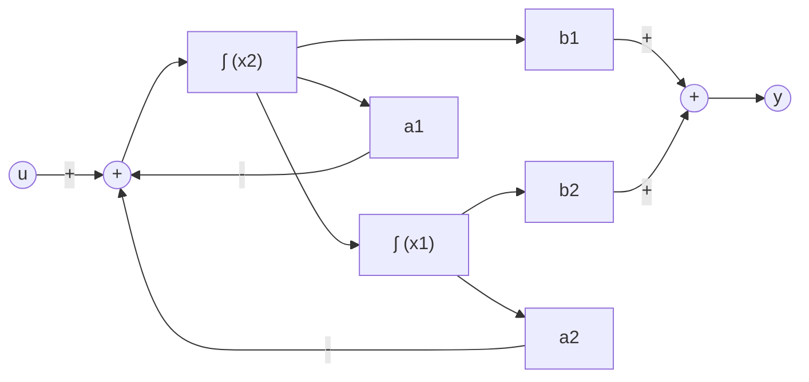
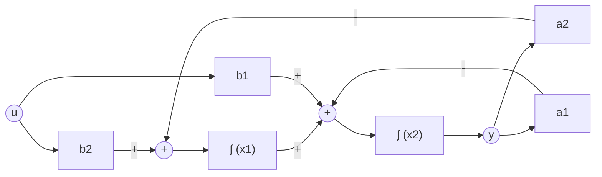
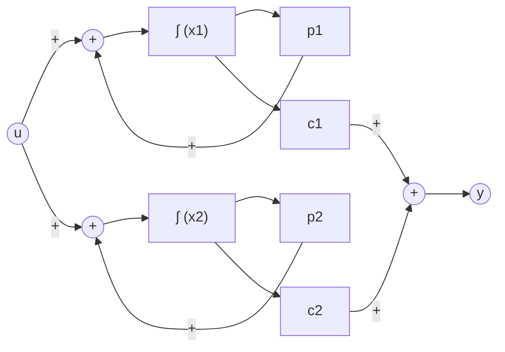
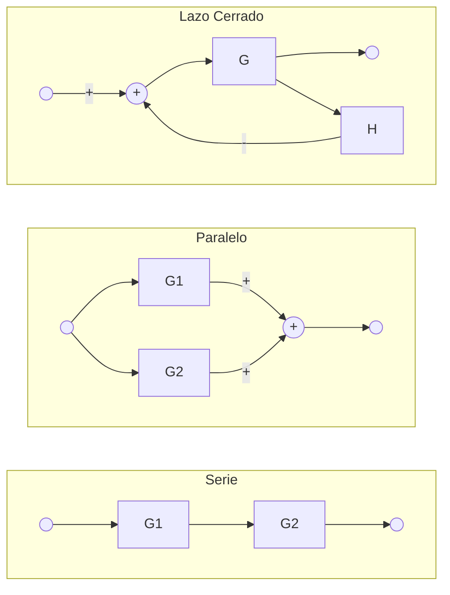
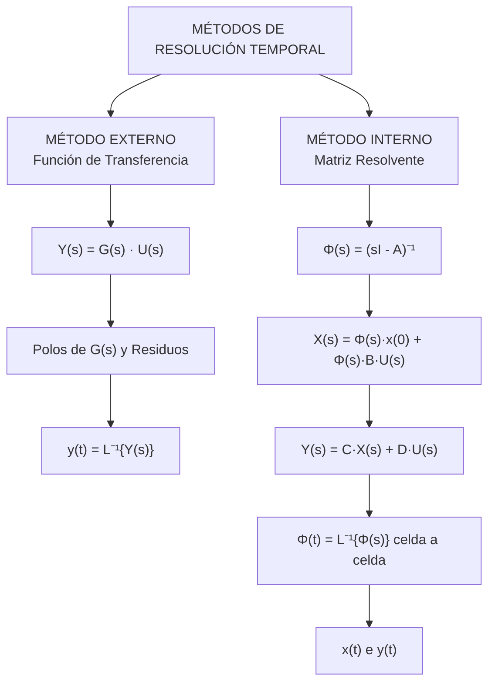

# Guía Maestra Consolidada: Sistemas Lineales, Diagramas de Bloques y Estabilidad
*(Tecnologías para la Automatización - UTN)*

---

## 1. Fundamentos: Representación Interna vs. Externa

Cualquier sistema dinámico lineal e invariante en el tiempo (LTI) se modela mediante dos representaciones matemáticas complementarias:

### Representación Interna (Variables de Estado)
Describe la memoria física y las dinámicas internas del sistema a través de ecuaciones diferenciales de primer orden acopladas:
$$
\begin{cases} 
\mathbf{\dot{x}}(t) = A\mathbf{x}(t) + B u(t) & \text{(Ecuación de Estado)} \\ 
y(t) = C\mathbf{x}(t) + D u(t) & \text{(Ecuación de Salida)} 
\end{cases}
$$

**Anatomía de las Variables:**
* $\mathbf{x}(t)$ **(Vector de Estado):** Variables internas que almacenan la energía del sistema.
* $\mathbf{\dot{x}}(t)$ **(Vector de Derivadas):** Variación temporal de los estados.
* $u(t)$ **(Entrada):** Excitación o señal externa.
* $y(t)$ **(Salida):** Variable física que efectivamente se mide.
* $A$ **(Matriz Dinámica):** Modela cómo interactúan los estados entre sí.
* $B$ **(Matriz de Entrada):** Pondera qué variables de estado son afectadas por $u(t)$.
* $C$ **(Matriz de Salida):** Combina linealmente los estados para formar $y(t)$.

### Representación Externa (Función de Transferencia)
Relaciona la entrada y la salida en el dominio de Laplace bajo condiciones iniciales nulas:
$$G(s) = \frac{Y(s)}{U(s)} = \frac{N(s)}{D(s)}$$

**Nexo Analítico:**
$$G(s) = C(sI - A)^{-1}B + D$$

---

## 2. Formas Canónicas y Diagramas de Bloques

Dada una función de transferencia de orden 2 estrictamente propia:
$$G(s) = \frac{b_1 s + b_2}{s^2 + a_1 s + a_2}$$
*(Nota: El coeficiente de $s^2$ debe ser 1. Si no lo es, dividir todo por ese valor).*

### A. Forma Canónica Controlable (FCC)
**Concepto:** La señal $u(t)$ entra exclusivamente por la última derivada de estado ($\dot{x}_2$). Las demás variables forman una cadena de integradores en serie.

**Matrices:**
$$A = \begin{bmatrix} 0 & 1 \\ -a_2 & -a_1 \end{bmatrix}, \quad B = \begin{bmatrix} 0 \\ 1 \end{bmatrix}, \quad C = \begin{bmatrix} b_2 & b_1 \end{bmatrix}$$

**Diagrama de Bloques (Orden 2):**

### B. Forma Canónica Observable (FCO)
**Concepto:** Es la versión dual traspuesta de la FCC ($A_{FCO} = A_{FCC}^T$, etc.). La salida $y(t)$ se toma directamente del último integrador.

**Matrices:**
$$A = \begin{bmatrix} 0 & -a_2 \\ 1 & -a_1 \end{bmatrix}, \quad B = \begin{bmatrix} b_2 \\ b_1 \end{bmatrix}, \quad C = \begin{bmatrix} 0 & 1 \end{bmatrix}$$

**Diagrama de Bloques (Orden 2):**

### C. Forma Canónica Diagonal (FCD)
**Concepto:** Desacopla las variables; requiere polos reales y distintos ($p_1, p_2$).
Se extraen los residuos por fracciones simples: $G(s) = \frac{c_1}{s - p_1} + \frac{c_2}{s - p_2}$.

**Matrices:**
$$A = \begin{bmatrix} p_1 & 0 \\ 0 & p_2 \end{bmatrix}, \quad B = \begin{bmatrix} 1 \\ 1 \end{bmatrix}, \quad C = \begin{bmatrix} c_1 & c_2 \end{bmatrix}$$

**Diagrama de Bloques (Orden 2):**

---

## 3. Álgebra y Reducción de Diagramas de Bloques

Permite obtener la función de transferencia equivalente de cualquier sistema interconectado mediante transformaciones algebraicas.

**Fórmulas Básicas:**
* **Cascada:** $G_{eq}(s) = G_1(s) \cdot G_2(s)$
* **Paralelo:** $G_{eq}(s) = G_1(s) \pm G_2(s)$
* **Lazo Cerrado:** $G_{eq}(s) = \frac{G(s)}{1 \pm G(s)H(s)}$ *(El signo en el denominador es opuesto al signo con el que entra la realimentación al sumador)*.

**Movimiento de Nodos para Destrabar Lazos:**
* **Bifurcación hacia adelante de G:** Agregar divisor $\frac{1}{G(s)}$ en la rama desplazada.
* **Bifurcación hacia atrás de G:** Agregar multiplicador $G(s)$ en la rama desplazada.
* **Suma hacia adelante de G:** Agregar multiplicador $G(s)$ en la rama desplazada.
* **Suma hacia atrás de G:** Agregar divisor $\frac{1}{G(s)}$ en la rama desplazada.

---

## 4. Métodos de Resolución Temporal Completa

Resolver el sistema implica calcular $y(t)$ (salida) y $\mathbf{x}(t)$ (estados internos) ante un estímulo.

### Método A: Resolución Externa
Calcula la salida global asumiendo condiciones iniciales nulas ($\mathbf{x}(0) = \mathbf{0}$).
1. **Laplace:** $Y(s) = G(s) \cdot U(s)$.
2. **Fracciones simples:** Separar las raíces del denominador (polos).
3. **Antitransformada:** $y(t) = \mathcal{L}^{-1}\{Y(s)\}$ usando las tablas estándar.

### Método B: Resolución Interna (Formal)
Calcula toda la dinámica admitiendo condiciones iniciales no nulas $\mathbf{x}(0) \neq \mathbf{0}$.
1. **Matriz Resolvente:** Calcular $\Phi(s) = (sI - A)^{-1}$.
2. **Matriz de Transición:** $\Phi(t) = \mathcal{L}^{-1}\{\Phi(s)\}$. Se antitransforma celda por celda (evaluada en $t=0$ debe dar la Identidad).
3. **Vector de Estados:** $\mathbf{X}(s) = \Phi(s)\mathbf{x}(0) + \Phi(s)BU(s)$.
4. **Salida:** $Y(s) = C\mathbf{X}(s) + DU(s)$.
5. **Dominio Temporal:** Fracciones simples y antitransformada para obtener $\mathbf{x}(t)$ e $y(t)$.

---

## 5. Análisis de la Salida: Regímenes y Sistemas

### Sistemas de Primer Orden
Función estándar:
$$G(s) = \frac{1}{1 + Ts}$$
* $T$: Constante de tiempo. En $t = 4T$ alcanza el $98\%$ del valor final.
* **Escalón ($1/s$):** $y(t) = 1 - e^{-t/T}$.
* **Rampa ($1/s^2$):** $y(t) = t - T + Te^{-t/T}$.

### Sistemas de Segundo Orden
Función estándar:
$$G(s) = \frac{\omega_n^2}{s^2 + 2\xi\omega_n s + \omega_n^2}$$
* $\omega_n$: Frecuencia natural no amortiguada.
* $\xi$: Factor de amortiguamiento relativo.

**Clasificación por $\xi$:**
* $\xi > 1$: **Sobreamortiguado.** Lento, monótono, sin sobrepaso.
* $\xi = 1$: **Críticamente amortiguado.** Más rápido posible sin llegar a oscilar.
* $0 < \xi < 1$: **Subamortiguado.** Oscilatorio con envolvente decreciente.
* $\xi = 0$: **Oscilatorio sostenido.** Onda senoidal pura de amplitud constante.
* $\xi < 0$: **Inestable.** Oscilaciones o exponenciales crecientes al infinito.

---

## 6. Estabilidad: Criterio de Routh-Hurwitz

Para determinar si la ecuación característica $D(s) = 0$ tiene polos inestables sin factorizarla.
$$D(s) = a_0 s^n + a_1 s^{n-1} + a_2 s^{n-2} + \dots + a_n = 0$$

**1. Condición de Cardano-Vieta:**
Todos los coeficientes $a_i$ deben existir y tener el mismo signo. Si no, es inestable de inmediato.

**2. Arreglo de Routh:**
$$
\begin{matrix}
s^n & | & a_0 & a_2 & a_4 \\
s^{n-1} & | & a_1 & a_3 & a_5 \\
s^{n-2} & | & b_1 & b_2 & b_3 \\
s^{n-3} & | & c_1 & c_2 & c_3
\end{matrix}
$$

Fórmulas pivote:
$$b_1 = \frac{a_1 a_2 - a_0 a_3}{a_1}, \quad b_2 = \frac{a_1 a_4 - a_0 a_5}{a_1}$$
$$c_1 = \frac{b_1 a_3 - a_1 b_2}{b_1}$$

**3. Criterio de Decisión:**
Es **estable** si y solo si todos los valores de la **primera columna** tienen signo positivo. El número de cambios de signo equivale al número de raíces inestables.

**Cálculo de rango $K$:** Armar la tabla dejando $K$ en los términos. Plantear inecuaciones exigiendo que cada fila de la primera columna sea $>0$. Intersectar para obtener $K_{mín} < K < K_{máx}$.

---

## 7. Estabilidad Interna: Plano de Fase

Para sistemas $\mathbf{\dot{x}}(t) = A \mathbf{x}(t)$ de orden 2, el Plano de Fase grafica $x_2$ en función de $x_1$, formando **trayectorias de estado**.
El punto de equilibrio se define donde las derivadas son nulas ($\mathbf{\dot{x}} = \mathbf{0}$). En sistemas lineales esto es el origen $(0,0)$.

**Estabilidad por Autovalores de $A$ ($\det(\lambda I - A) = 0$):**
* **Reales distintos $< 0$:** **Nodo Estable** (converge al origen).
* **Reales distintos $> 0$:** **Nodo Inestable** (diverge del origen).
* **Reales con signos opuestos:** **Punto Silla / Ensilladura** (Inestable, escapan por un eje).
* **Complejos con $\text{Re} < 0$:** **Foco Estable** (espiral hacia adentro).
* **Complejos con $\text{Re} > 0$:** **Foco Inestable** (espiral hacia afuera).
* **Imaginarios puros ($\text{Re}=0$):** **Centro** (órbitas cerradas, estabilidad marginal).

**Cálculo Analítico de la Trayectoria $x_2(x_1)$:**
1. Integrar el sistema temporal: $x_1(t) = x_1(0)e^{\lambda_1 t}$ y $x_2(t) = x_2(0)e^{\lambda_2 t}$.
2. Despejar la base exponencial $e^t$ en la primera ecuación.
3. Reemplazarla en la segunda ecuación para eliminar el tiempo $t$.